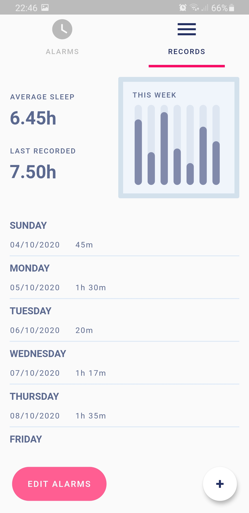

# Clock UI

A [Flutter](https://flutter.dev/) application for representing my UI creating skills.

## External Packages

* flutter_launcher_icons: ^0.8.1
* flutter_launcher_name: ^0.0.1
* lottie: ^0.6.0

## Android

[Download APK](release/app-release.apk)

## Screenshots
|||
|---|---|

## Credits

* Style [Dribbble](https://dribbble.com/shots/6259293-Sleep-Tracker-App)
* Clock mechanism [Philip Okonkwo](https://medium.com/@NPKompleet/creating-an-analog-clock-in-flutter-i-68def107d9f4)
